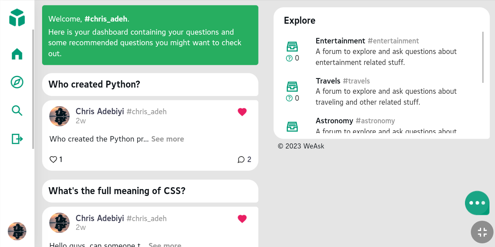
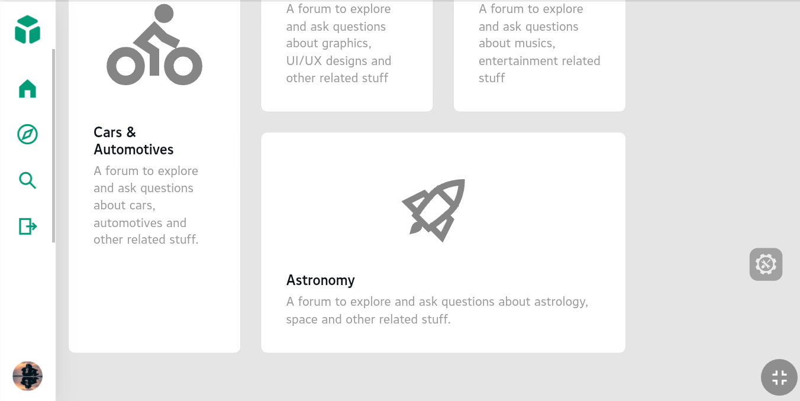
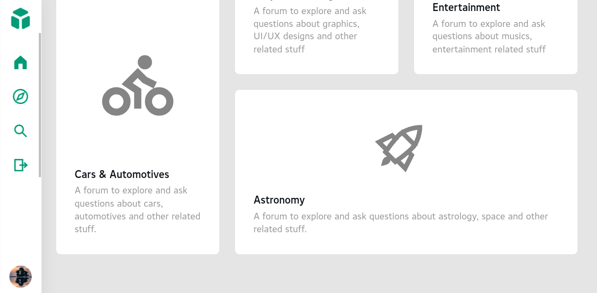
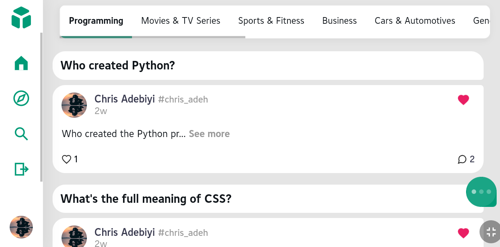
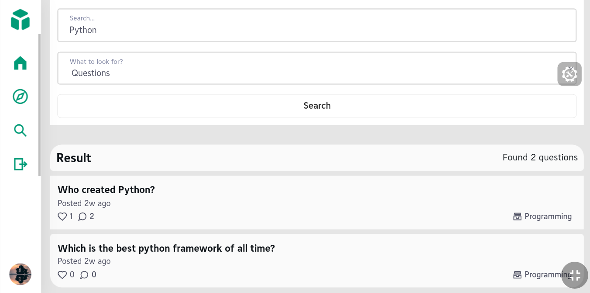

# <sup>We</sup>Ask
<p>WeAsk is a place which makes it possible for people who have knowledge to connect with the people who's in need of it. To connect together people of different perspective so they can understand each other on a particular topic or more.</p>
<p>WeAsk is a place where people ask questions that matter to you and get answers from people who have been there, people who has experience such, people who have done that. </p>









## Links

* [Web site](https://weask.bytecodevision.tech/)
* [About](https://landing.bytecodevision.tech/)
* [Blog](https://weask.bytecodevision.tech/about/)
* [Source code](https://github.com/Chris-ade/weask)

## Installation

To clone and run this application, you'll need [Python](https://www.python.org/downloads/release/python-3111/) (which comes with [pip](https://pip.pypa.io/en/stable/)) installed on your computer. 

This app uses the default SQLite database.

From your command line:
```bash
# Clone this repository
$ git clone https://github.com/Chris-ade/weask

# Go into the repository
$ cd weask

# Create a virtual environment, replace env_name with your desired name
$ python3 -m venv env_name

# Activate the virtual environment 
$ source env_name/bin/activate

# Install dependencies
(env_name) $ pip install -r requirements.txt

# Run migrations
(env_name) $ python3 manage.py makemigrations
(env_name) $ python3 manage.py migrate

# Run the server
(env_name) $ python3 manage.py runserver
```
> **Note**
> If you're using Windows OS use `python` or `py` instead of `python3` from the command prompt.

## Usage

Navigate to http://localhost:8000/ on your browser to see the app in action.
If everything goes right, you'll see the welcome page.

## Contributing

WeAsk is a portfolio project. I'll highly appreciate any contributions. Whether you are helping me fix bugs, proposing new features, improving the app one way or the other - I would love to have you as a part of the contributors.

## License

MIT

---
> LinkedIn [@Chris Adebiyi](https://www.linkedin.com/in/chris-adebiyi-266639189) <br>
> GitHub [@Chris-ade](https://github.com/Chris-ade) <br>
> Twitter [@chris_adeh](https://twitter.com/chris_adeh)
